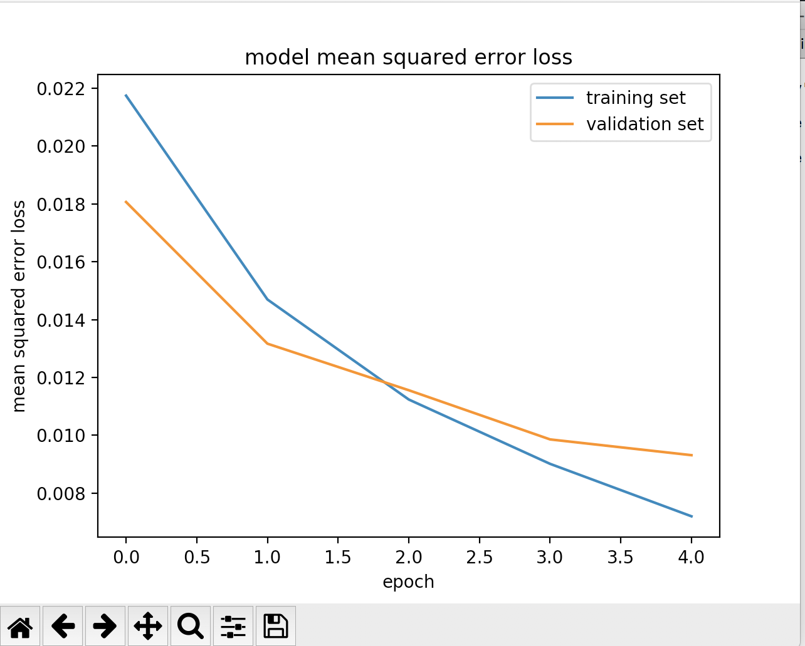
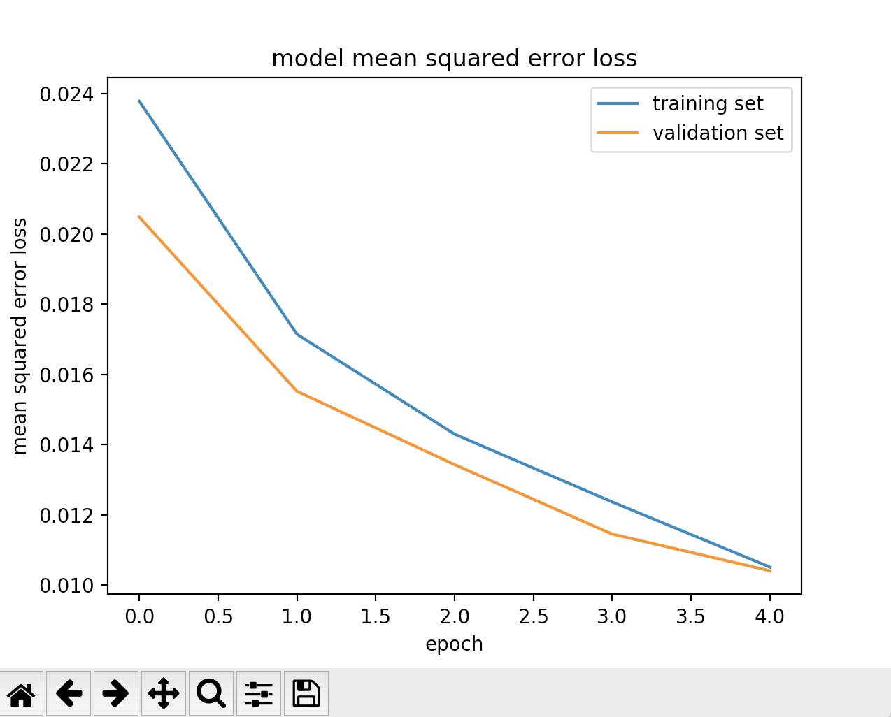
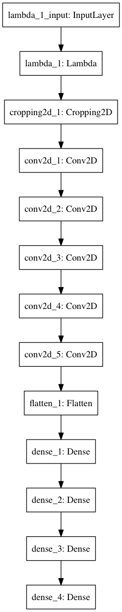
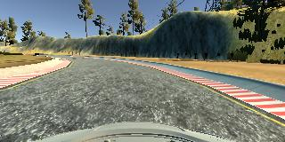
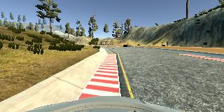
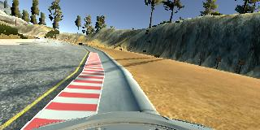
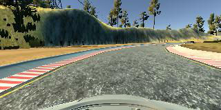

# **Behavioral Cloning Project**

The goals / steps of this project are the following:
* Use the simulator to collect data of good driving behavior
* Build, a convolution neural network in Keras that predicts steering angles from images
* Train and validate the model with a training and validation set
* Test that the model successfully drives around track one without leaving the road
* Summarize the results with a written report


## Rubric Points
---
### Files Submitted & Code Quality

#### 1. Submission includes all required files and can be used to run the simulator in autonomous mode

My project includes the following files:
* model.py containing the script to create and train the model
* drive.py for driving the car in autonomous mode
* model.h5 containing a trained convolution neural network
* writeup_report.md summarizing the results
* run1.mp4 recording of the vehicle driving autonomously at least one lap around the track

#### 2. Submission includes functional code
Using the Udacity provided simulator and my drive.py file, the car can be driven autonomously around the track by executing
```sh
python drive.py model.h5
```

#### 3. Submission code is usable and readable

The model.py file contains the code for training and saving the convolution neural network. The file shows the pipeline I used for training and validating the model, and it contains comments to explain how the code works.

### Model Architecture and Training Strategy

#### 1. An appropriate model architecture has been employed

My model uses NVIDIA network architecture, which includes a normalization layer, 5 convolutional layers, and 4 fully connected layers.
The model includes RELU layers to introduce nonlinearity, and the data is normalized in the model using a Keras lambda layer.

#### 2. Attempts to reduce overfitting in the model

The model adds a dropout layer (drop rate = 0.1) after each convolutional layer in order to reduce overfitting.

#### 3. Model parameter tuning

The model used an adam optimizer, so the learning rate was not tuned manually.

#### 4. Appropriate training data

Training data was chosen to keep the vehicle driving on the road. I used a combination of center lane driving, recovering from the left and right sides of the road.

For details about how I created the training data, see the next section.

### Implementation Details

#### 1. Solution Design Approach

My first step was to use a convolution neural network model that published by NVIDIA (https://devblogs.nvidia.com/parallelforall/deep-learning-self-driving-cars/)

In order to gauge how well the model was working, I split my image and steering angle data into a training and validation set. The following "model mean squared error loss" chart shows that the model had a low mean squared error on the training set but a high mean squared error on the validation set after epoch 2. This implied that the model was overfitting.


To combat the overfitting, I modified the model by adding a dropout layer (drop rate = 0.1) after each convolutional layer. And the "model mean squared error loss" chart for the updated model is:


The final step was to run the simulator to see how well the car was driving around track one. There were a few spots where the vehicle fell off the track. To improve the driving behavior in these cases, I added more data by recording the vehicle recovering from the left side and right sides of the road back to center, so that the vehicle would learn how to drive from the side of the road back toward the center line.

At the end of the process, the vehicle is able to drive autonomously around the track without leaving the road.

#### 2. Final Model Architecture

The final model architecture consisted of a convolution neural network with the following layers and layer sizes:

| Layer         		|     Description	        					|
|:---------------------:|:---------------------------------------------:|
| Input         		| 160x320x3   							|
| Normalization         		| 160x320x3   							|
| Cropping2D        | outputs 65x320x3|
| Convolution-1 5x5     	| 2x2 stride, valid padding, outputs 31x158x24 	|
| Convolution-2 5x5	    | 2x2 stride, valid padding, outputs 14x77x36      									|
| Convolution-3 5x5     	| 2x2 stride, valid padding, outputs 5x37x48 	|
| Convolution-4 3x3	    | 1x1 stride, valid padding, outputs 3x35x64    									|
| Convolution-5 3x3	    | 1x1 stride, valid padding, outputs 1x33x64      									|
| Fully connected-1 | input 2112, output 100        									|
| Fully connected-2 | input 100, output 50        									|
| Fully connected-3 | input 50, output 10        									|
| Fully connected-4 | input 10, output 1        									|

Here is a visualization of the architecture



#### 3. Creation of the Training Set & Training Process

To capture good driving behavior, I first recorded two laps on track one using center lane driving.

Here is an example image of center lane driving:


I then recorded the vehicle recovering from the left side and right sides of the road back to center so that the vehicle would learn how to drive from the side of the road back toward the center line. These images show what a recovery looks like:
1. recover from left to center:        

2. recover from right to center:        


To augment the data sat, I also flipped images and angles thinking that this would help with the left turn bias. For example: For example, here is an image that has then been flipped:

Original center view image:


Flipped center view image:



After the collection process, I had 17121 number of data points. I then preprocessed this data by normalization and cropping.

I finally randomly shuffled the data set and put 20% of the data into a validation set.

I used this training data for training the model. The validation set helped determine if the model was over or under fitting. The ideal number of epochs was 5 as evidenced by the following training/validation loss output for each epoch:
```
Epoch 1/5
17121/17121 [==============================] - 295s - loss: 0.0238 - val_loss: 0.0205
Epoch 2/5
17121/17121 [==============================] - 296s - loss: 0.0171 - val_loss: 0.0155
Epoch 3/5
17121/17121 [==============================] - 295s - loss: 0.0143 - val_loss: 0.0134
Epoch 4/5
17121/17121 [==============================] - 296s - loss: 0.0124 - val_loss: 0.0114
Epoch 5/5
17121/17121 [==============================] - 294s - loss: 0.0105 - val_loss: 0.0104
```
 I used an adam optimizer so that manually training the learning rate wasn't necessary.
