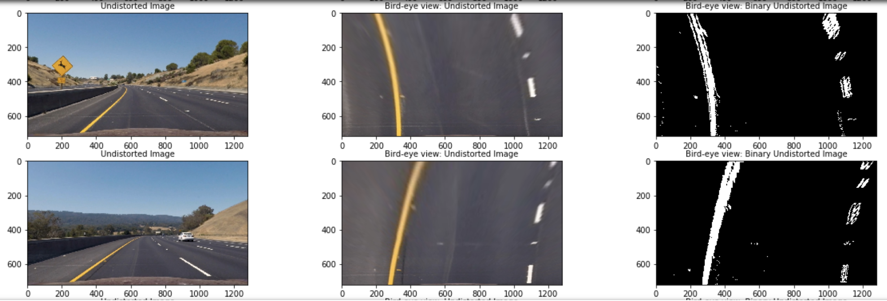

## Advanced Lane Finding Project

The goals / steps of this project are the following:

* Compute the camera calibration matrix and distortion coefficients given a set of chessboard images.
* Apply a distortion correction to raw images.
* Use color transforms, gradients, etc., to create a thresholded binary image.
* Apply a perspective transform to rectify binary image ("birds-eye view").
* Detect lane pixels and fit to find the lane boundary.
* Determine the curvature of the lane and vehicle position with respect to center.
* Warp the detected lane boundaries back onto the original image.
* Output visual display of the lane boundaries and numerical estimation of lane curvature and vehicle position.


## [Rubric](https://review.udacity.com/#!/rubrics/571/view) Points

### Here I will consider the rubric points individually and describe how I addressed each point in my implementation.  

---

### Writeup / README

#### 1. Provide a Writeup / README that includes all the rubric points and how you addressed each one.  

You're reading it!

### Camera Calibration

#### 1. Briefly state how you computed the camera matrix and distortion coefficients. Provide an example of a distortion corrected calibration image.

The code for this step is contained in the first code cell of the IPython notebook located in "final.ipynb" .  

I start by preparing "object points", which will be the (x, y, z) coordinates of the chessboard corners in the world. Here I am assuming the chessboard is fixed on the (x, y) plane at z=0, such that the object points are the same for each calibration image.  Thus, `objp` is just a replicated array of coordinates, and `objpoints` will be appended with a copy of it every time I successfully detect all chessboard corners in a test image.  `imgpoints` will be appended with the (x, y) pixel position of each of the corners in the image plane with each successful chessboard detection.  

I then used the output `objpoints` and `imgpoints` to compute the camera calibration and distortion coefficients using the `cv2.calibrateCamera()` function.  I applied this distortion correction to the test image using the `cv2.undistort()` function and obtained this result:


### Pipeline (single images)

#### 1. Provide an example of a distortion-corrected image.

The example below shows the changes on the left side tree and the right side white car after the distortion correction applied:


#### 2. Describe how (and identify where in your code) you used color transforms, gradients or other methods to create a thresholded binary image.  Provide an example of a binary image result.

I used a combination of color and gradient thresholds to generate a binary image. The implementation details can be found in function `thresholded_binary_pipeline(img, s_thresh=(170, 255), sx_thresh=(20, 100))` in the 4th code cell).  Here's an example of my output for this step.


#### 3. Describe how (and identify where in your code) you performed a perspective transform and provide an example of a transformed image.

To calculates a perspective transform, we need to first decide four pairs of the corresponding points. In this project, I manually chose the following source and destination points based on `test_images/straight_lines1.jpg`:
```python
src_pts = np.float32([[255,685],[1054,685],[704,461], [579,461]])
dst_pts = np.float32([[255,719],[1054,719],[1054,0],[255,0]])
```

The 3x3 tranform matrix is calculated like this:
```python
warp_M = cv2.getPerspectiveTransform(src_pts, dst_pts)
```

In the example below, the lines in the warped images appear parallel, which shows that the perspective transform was working as expected.



#### 4. Describe how (and identify where in your code) you identified lane-line pixels and fit their positions with a polynomial?

I tried both the sliding window and the skipping window approaches as described in section `Locate the Lane Lines and Fit a Polynomial`. Here are the visualization results:
1. Sliding window


2. Skipping window: search in a margin around the previous line position


#### 5. Describe how you calculated the radius of curvature of the lane and the position of the vehicle with respect to center.
The radius of curvature is calculated based on the following formula described in https://www.intmath.com/applications-differentiation/8-radius-curvature.php:


The python code implementation is:
```python
curverad = ((1 + (2*fit_cr[0]*y_eval*ym_per_pix + fit_cr[1])**2)**1.5) / np.absolute(2*fit_cr[0])
```

The position of the vehicle is described as the distance from the middle of detected lane to the middle of image.

#### 6. Provide an example image of your result plotted back down onto the road such that the lane area is identified clearly.

The plot back logic is implemented in function `draw_image(img, left_fit, right_fit, avg_curverad)`.

Here are some examples of the result plotted back onto the test images:


---

### Pipeline (video)

#### 1. Provide a link to your final video output.  Your pipeline should perform reasonably well on the entire project video (wobbly lines are ok but no catastrophic failures that would cause the car to drive off the road!).

Here's a [link to my video result](output_images/project_output.mp4)

---

### Discussion

#### 1. Briefly discuss any problems / issues you faced in your implementation of this project.  Where will your pipeline likely fail?  What could you do to make it more robust?
Things to be improved:
1. In perspective transform, the four pairs of the corresponding points are manually marked, so the result may not be accurate. Could consider to pick up more sets of points and run average on the transform matrix to improve the accuracy.
2. In project video, the right line is dotted line and the left line is solid. Since the two lines are parallel, could do data augmentation to add more points to the right line based on the points detected on left line.
