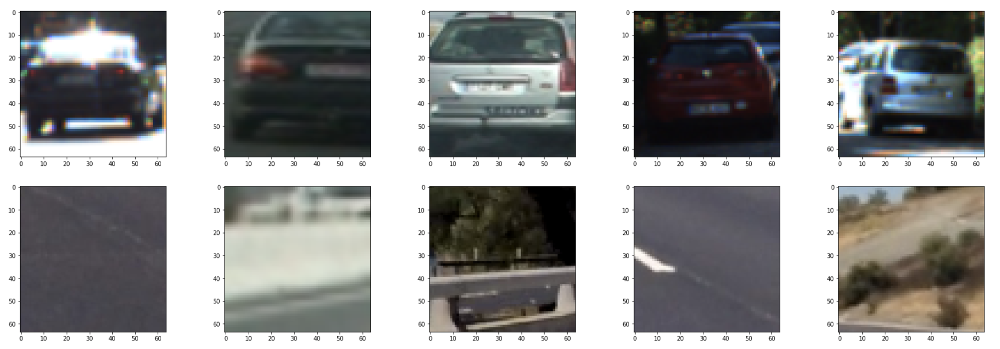

**Vehicle Detection Project**

The goals / steps of this project are the following:

* Perform a Histogram of Oriented Gradients (HOG) feature extraction on a labeled training set of images and train a classifier Linear SVM classifier
* Optionally, you can also apply a color transform and append binned color features, as well as histograms of color, to your HOG feature vector.
* Note: for those first two steps don't forget to normalize your features and randomize a selection for training and testing.
* Implement a sliding-window technique and use your trained classifier to search for vehicles in images.
* Run your pipeline on a video stream (start with the test_video.mp4 and later implement on full project_video.mp4) and create a heat map of recurring detections frame by frame to reject outliers and follow detected vehicles.
* Estimate a bounding box for vehicles detected.


## [Rubric](https://review.udacity.com/#!/rubrics/513/view) Points

---
### Writeup / README

#### 1. Provide a Writeup / README that includes all the rubric points and how you addressed each one.  You can submit your writeup as markdown or pdf.  

You're reading it!

### Histogram of Oriented Gradients (HOG)

#### 1. Explain how (and identify where in your code) you extracted HOG features from the training images.

I started by reading in all the `vehicle` and `non-vehicle` images.  (See the code cells under "1. read in all the vehicle and non-vehicle images, and display the dataset info" in final.ipynb.)
Here is an example of five of each of the `vehicle` and `non-vehicle` classes:




I then explored different color spaces and different `skimage.hog()` parameters (`orientations`, `pixels_per_cell`, and `cells_per_block`).  I grabbed random images from each of the two classes and displayed them to get a feel for what the `skimage.hog()` output looks like.

Here are some examples using different color spaces and HOG parameters of (`orientations=9`, `pixels_per_cell=(8, 8)`, `cells_per_block=(2, 2)`) and (`orientations=12`, `pixels_per_cell=(16, 16)`, `cells_per_block=(2, 2)`):


#### 2. Explain how you settled on your final choice of HOG parameters.
In code cells under "3. Explore various combinations of colorspaces, hog_channels, orientations, pixels_per_cell, and cells_per_block", I first tried various colorspaces and hog_channels with fixed settings on (`orientations=8`, `pixels_per_cell=(8, 8)`, `cells_per_block=(2, 2)`).

|colorspace| orientations |pixels/cell| cells/block| channel| time to extract features| time to train| accuracy|
| --- | --- | --- | --- | --- | --- | --- | --- |
|RGB| 8 |8| 2| 0| 30.18| 9.61| 0.9381|
|RGB|8|8|2|1|33.4|7.77|0.9457|
|RGB|8|8|2|2|30.5|7.75|0.9451|
|RGB|8|8|2|ALL|69.8|18.95|0.9586|
|HSV|8|8|2|0|44.02|16.53|0.8995|
|HSV|8|8|2|1|32.5|22.39|0.8981|
|HSV|8|8|2|2|30.58|7.95|0.9521|
|**HSV**|8|8|2|**ALL**|71.21|15.08|**0.9775**|
|LUV|8|8|2|0|45.5|8.27|0.9462|
|LUV|8|8|2|1|32.83|19.07|0.9172|
|LUV|8|8|2|2|34.54|21.69|0.9091|
|LUV|8|8|2|ALL|72.24|18.04|0.9597|
|HLS|8|8|2|0|44.35|19.08|0.9071|
|HLS|8|8|2|1|31.82|7.65|0.9443|
|HLS|8|8|2|2|33.0|23.38|0.8863|
|HLS|8|8|2|ALL|71.47|15.24|0.9727|
|YUV|8|8|2|0|42.66|8.26|0.9482|
|YUV|8|8|2|1|31.93|12.95|0.9313|
|YUV|8|8|2|2|32.53|20.28|0.8958|
|**YUV**|8|8|2|**ALL**|70.61|13.67|**0.9783**|
|YCrCb|8|8|2|0|39.84|7.98|0.9482|
|YCrCb|8|8|2|1|33.14|13.24|0.931|
|YCrCb|8|8|2|2|31.38|18.38|0.9122|
|**YCrCb**|8|8|2|**ALL**|70.7|13.47|**0.9764**|

Then, I tried various settings on `orientations`, `pixels_per_cell`, `cells_per_block` using the top three colorspaces `HSV`/`YUV`/`YCrCb`

|colorspace| orientations |pixels/cell| cells/block| channel| time to extract features| time to train| accuracy|
| --- | --- | --- | --- | --- | --- | --- | --- |
|HSV|8|8|2|ALL|89.78|14.96|0.9786|
|HSV|8|16|2|ALL|60.31|2.54|0.9671|
|HSV|9|8|2|ALL|73.47|19.32|0.9814|
|HSV|9|16|2|ALL|61.08|3.3|0.9626|
|**HSV**|**10**|**8**|2|ALL|76.8|20.88|**0.9873**|
|HSV|10|16|2|ALL|62.07|2.37|0.9735|
|YUV|8|8|2|ALL|73.88|13.85|0.982|
|YUV|8|16|2|ALL|45.77|2.19|0.9707|
|YUV|9|8|2|ALL|73.17|16.77|0.9778|
|YUV|9|16|2|ALL|60.22|2.49|0.9738|
|YUV|10|8|2|ALL|73.3|14.08|0.9811|
|**YUV**|**10**|**16**|2|ALL|60.93|2.32|**0.98**|
|YCrCb|8|8|2|ALL|71.0|13.44|0.9783|
|YCrCb|8|16|2|ALL|43.67|2.34|0.9755|
|**YCrCb**|**9**|**8**|2|ALL|71.83|16.62|**0.9797**|
|YCrCb|9|16|2|ALL|44.52|2.54|0.9696|
|YCrCb|10|8|2|ALL|73.04|18.77|0.9789|
|YCrCb|10|16|2|ALL|61.75|2.23|0.9758|

#### 3. Describe how you trained a classifier using your selected HOG features.

I trained a linear SVM using LinearSVC() imported from sklearn.svm. The code details in code cell under "4. Train a classifier using the selected HOG features".   
From dataset, 80% of images are used for training, and the rest 20% are for testing.

### Sliding Window Search

#### 1. Describe how (and identify where in your code) you implemented a sliding window search.  How did you decide what scales to search and how much to overlap windows?

I tried the sliding window search with scales=[1,1.5,2,2.5,3]. The result below shows that the smaller vehicle image match should not occur at the bottom of images:


So I set the following search range for different scale:

|scales|1|1.5|2|2.5|3|
|:---------------------:|:-------------------------:|:-------------------------:|:-------------------------:|:-------------------------:|:-------------------------:|
|ystart|340|340|340|340|340|
|ystop|500|525|600|675|719|


#### 2. Show some examples of test images to demonstrate how your pipeline is working.  What did you do to optimize the performance of your classifier?

Ultimately I did the search using YCrCb 3-channel HOG features with  (`orientations=9`, `pixels_per_cell=(8, 8)`, `cells_per_block=(2, 2)`).  Here are some example images:


---

### Video Implementation

#### 1. Provide a link to your final video output.  Your pipeline should perform reasonably well on the entire project video (somewhat wobbly or unstable bounding boxes are ok as long as you are identifying the vehicles most of the time with minimal false positives.)
Here's a [link to my video result](output_images/project_output.mp4)


#### 2. Describe how (and identify where in your code) you implemented some kind of filter for false positives and some method for combining overlapping bounding boxes.

I used the method described in [section "Multiple Detections & False Positives"](https://classroom.udacity.com/nanodegrees/nd013/parts/fbf77062-5703-404e-b60c-95b78b2f3f9e/modules/2b62a1c3-e151-4a0e-b6b6-e424fa46ceab/lessons/fd66c083-4ccb-4fe3-bda1-c29db76f50a0/concepts/de41bff0-ad52-493f-8ef4-5506a279b812) to filter for false positives and combine overlapping bounding boxes.

Here's an example result showing the heatmap from different scales and the bounding boxes:


---

### Discussion

#### 1. Briefly discuss any problems / issues you faced in your implementation of this project.  Where will your pipeline likely fail?  What could you do to make it more robust?
a. some very narrow narrow rectangles could be created during the filtering for false positives based on heat-map. So I added the following logic to filter this type of false positive:
```           
    bRadio=(bbox[1][0]-bbox[0][0])/(bbox[1][1]-bbox[0][1])
    if bRadio>0.33 and bRadio < 3:
        # Draw the box on the image
        cv2.rectangle(img, bbox[0], bbox[1], (0,0,255), 6)
```

b. At the beginning, I got exception when processing in color space LUV. Then I realized that I set `transform_sqrt=True` when calling `hog(image, orientations=9, pixels_per_cell=(8, 8), cells_per_block=(3, 3), block_norm='L1', visualize=False, visualise=None, transform_sqrt=False, feature_vector=True)`.
`transform_sqrt=True` cannot be used when the image contains negative value.

c. ToDo: need to improve the algorithm to consider the detection results from the previous frames.
