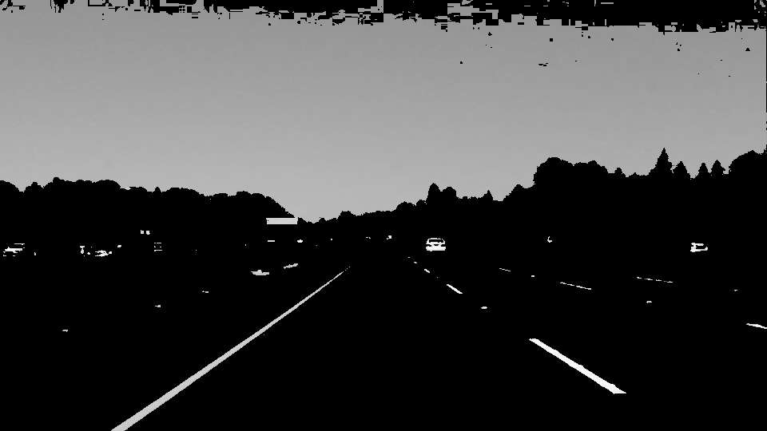
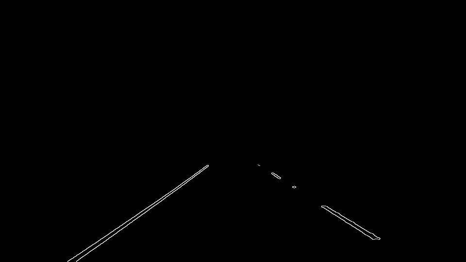
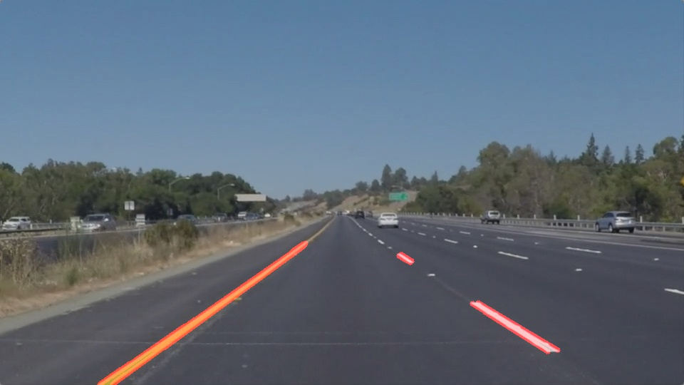
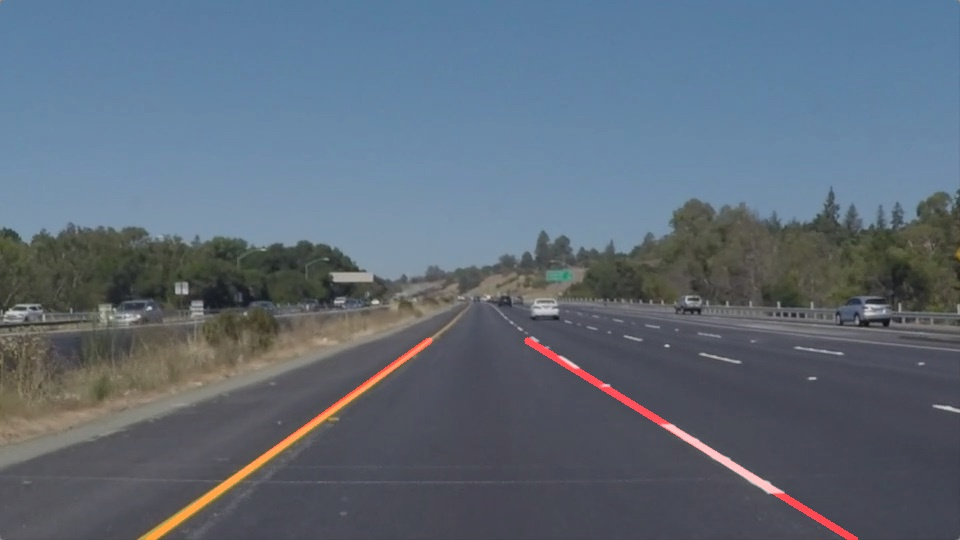

# **Finding Lane Lines on the Road**

### Overview
The goals / steps of this project are:
* Make a pipeline that finds lane lines on the road
* Reflect on the work in a written report

### Reflection

#### Lane Lines Detection Pipeline

The pipeline consists of the following steps:
###### 1. Color Conversion/Selection
Convert to HSV color space to highlight the yellow and white lines, and save the output to grayscale for edge detection.

###### 2. Canny Edge Detection
Apply Gaussian Smoothing to reduce noise before running Canny Edge Detection. And mask the output with region of interest.

###### 3. Hough Transform

###### 4. Line Segments Average/Extrapolation

The current implementation is:
* calculate slopes for each line, and divide the lines to two groups: positive and negative
* set pos_min_slope/neg_max_slope to remove the near-horizontal lines
* remove outliers based on standard deviation
* find the average slope and intercept for each group, using line lengths as the weights
* draw averaged/extrapolated lines from the bottom of the image

#### Shortcomings
1. Threshold values are manually picked based on the sample images/videos. They may not work well for other inputs.
2. The current pipeline may not work when the lane lines are blocked by other cars on the road.

#### Possible Improvements
1. Create training data and models to automatically decide the thresholds.
2. While processing video, adjust the line slope/intercept based on the results from preivous frames

### Results
1. [solidWhiteRight.mp4](https://github.com/CarNdQL/CarNdTerm1/blob/master/FindingLaneLines/test_videos_output/solidWhiteRight.mp4)
2. [solidYellowLeft.mp4](https://github.com/CarNdQL/CarNdTerm1/blob/master/FindingLaneLines/test_videos_output/solidYellowLeft.mp4)
3. [challenge.mp4](https://github.com/CarNdQL/CarNdTerm1/blob/master/FindingLaneLines/test_videos_output/challenge.mp4)
