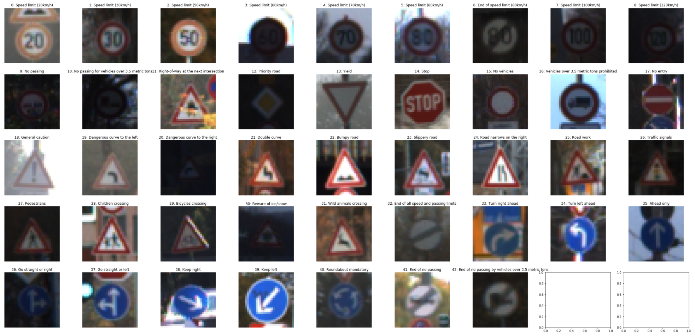
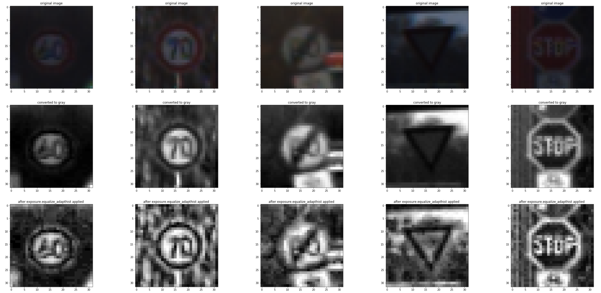
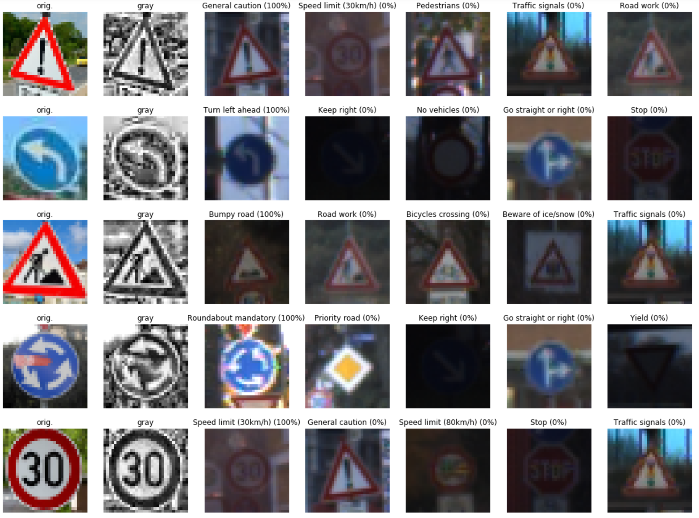

# **Traffic Sign Classifier**

---

**Build a Traffic Sign Classifier Project**

The goals / steps of this project are the following:
* Load the data set (see below for links to the project data set)
* Explore, summarize and visualize the data set
* Design, train and test a model architecture
* Use the model to make predictions on new images
* Analyze the softmax probabilities of the new images
* Summarize the results with a written report

[//]: # (Image References)

[image1]: ./examples/visualization.jpg "Visualization"
[image2]: ./examples/grayscale.jpg "Grayscaling"
[image3]: ./examples/random_noise.jpg "Random Noise"
[image4]: ./examples/placeholder.png "Traffic Sign 1"
[image5]: ./examples/placeholder.png "Traffic Sign 2"
[image6]: ./examples/placeholder.png "Traffic Sign 3"
[image7]: ./examples/placeholder.png "Traffic Sign 4"
[image8]: ./examples/placeholder.png "Traffic Sign 5"

## Rubric Points
Here I will consider the [rubric points](https://review.udacity.com/#!/rubrics/481/view) individually and describe how I addressed each point in my implementation.

---

You're reading it! and here is a link to my [project code](https://github.com/CarNdQL/CarNdTerm1/tree/master/TrafficSignClassifier/Traffic_Sign_Classifier-GrayNorm.ipynb)

### Data Set Summary & Exploration

I used the numpy library to calculate summary statistics of the traffic
signs data set:

* The size of training set is ?   **34799**
* The size of the validation set is?   **4410**
* The size of test set is ?   **12630**
* The shape of a traffic sign image is ?   **(32, 32, 3)**
* The number of unique classes/labels in the data set is ?   **43**

Here is an exploratory visualization of the data set.

The data set contains 43 unique classes of traffic sign. And the sample images for each class are shown below:

The data distribution by classes are:

### Design and Test a Model Architecture

#### 1. Describe how you preprocessed the image data. What techniques were chosen and why did you choose these techniques? Consider including images showing the output of each preprocessing technique. Pre-processing refers to techniques such as converting to grayscale, normalization, etc. (OPTIONAL: As described in the "Stand Out Suggestions" part of the rubric, if you generated additional data for training, describe why you decided to generate additional data, how you generated the data, and provide example images of the additional data. Then describe the characteristics of the augmented training set like number of images in the set, number of images for each class, etc.)

As a first step, I decided to convert the images to grayscale because:
1. the traffic signs should work for color-blind people, so the shape of the sign should provide enough information for classification.
2. the data to be processed can be reduced significantly, so the training can take less time and less computational resources.

Secondly, exposure.equalize_adapthist is applied to enhance the local contrast.  

As a last step, I normalized the image data to make the optimization easier and faster

Here is the example of 5 traffic sign images before and after Pre-processing.

I decided to generate additional data because the data distribution is not balanced. The classes with more training images gain more weights during traing.

To add more data to the the data set, I generated new training data by rotating the existing data to a random degree. This is only done for classes with less than 500 training images.

The distribution differences between the original data set and the augmented data set are:

#### 2. Describe what your final model architecture looks like including model type, layers, layer sizes, connectivity, etc.) Consider including a diagram and/or table describing the final model.

My final model consisted of the following layers:

| Layer         		|     Description	        					|
|:---------------------:|:---------------------------------------------:|
| Input         		| 32x32x1 gray image   							|
| Convolution-1 5x5     	| 1x1 stride, valid padding, outputs 28x28x10 	|
| RELU-1					|												|
| Max pooling-1	      	| 2x2 stride,  outputs 14x14x10 				|
| Convolution-2 5x5	    | 1x1 stride, valid padding, outputs 10x10x20      									|
| RELU-2					|												|
| Max pooling-2	      	| 2x2 stride,  outputs 5x5x20 				|
| Fully connected-1 (Max pooling-2+half_of_Max pooling-1)		| input 500+490, output 360        									|
| Fully connected-2 | input 360, output 84        									|
| Fully connected-3 | input 84, output 43        									|

#### 3. Describe how you trained your model. The discussion can include the type of optimizer, the batch size, number of epochs and any hyperparameters such as learning rate.

To train the model, I used the AdamOptimizer with learning rate = 0.001
Other parameters used in the final solution are:
1. batch size = 128
2. epochs = 20

#### 4. Describe the approach taken for finding a solution and getting the validation set accuracy to be at least 0.93. Include in the discussion the results on the training, validation and test sets and where in the code these were calculated. Your approach may have been an iterative process, in which case, outline the steps you took to get to the final solution and why you chose those steps. Perhaps your solution involved an already well known implementation or architecture. In this case, discuss why you think the architecture is suitable for the current problem.

The first architecture I tried was LeNet-5 that implemented in the udacity LeNet lab section. The initial results are good with validation accuracy and test accuracy around 0.89. Then I read the example of the baseline model in http://yann.lecun.com/exdb/publis/pdf/sermanet-ijcnn-11.pdf and modified the structure by feeding Conv-1 stage features in addition to Conv-2 stage features to the classifier.

My final model results were:
* training set accuracy of ? **1.000**
* validation set accuracy of ? **0.973**
* test set accuracy of ? **0.955**

### Test a Model on New Images

#### 1. Choose five German traffic signs found on the web and provide them in the report. For each image, discuss what quality or qualities might be difficult to classify.

Here are five German traffic signs that I found on the web:

  
 

#### 2. Discuss the model's predictions on these new traffic signs and compare the results to predicting on the test set. At a minimum, discuss what the predictions were, the accuracy on these new predictions, and compare the accuracy to the accuracy on the test set (OPTIONAL: Discuss the results in more detail as described in the "Stand Out Suggestions" part of the rubric).

Here are the results of the prediction:

| Image			        |     Prediction	        					|
|:---------------------:|:---------------------------------------------:|
| General caution      		| General caution   									|
| Turn left ahead    			| Turn left ahead										|
| Road work					| Bumpy road											|
| Roundabout mandatory	      		| Roundabout mandatory				 				|
| Speed limit (30km/h)			| Speed limit (30km/h)     							|

The model was able to correctly guess 4 of the 5 traffic signs, which gives an accuracy of 80%.

#### 3. Describe how certain the model is when predicting on each of the five new images by looking at the softmax probabilities for each prediction. Provide the top 5 softmax probabilities for each image along with the sign type of each probability. (OPTIONAL: as described in the "Stand Out Suggestions" part of the rubric, visualizations can also be provided such as bar charts)

The test images and the top 5 softmax probabilities for each image are shown below:

